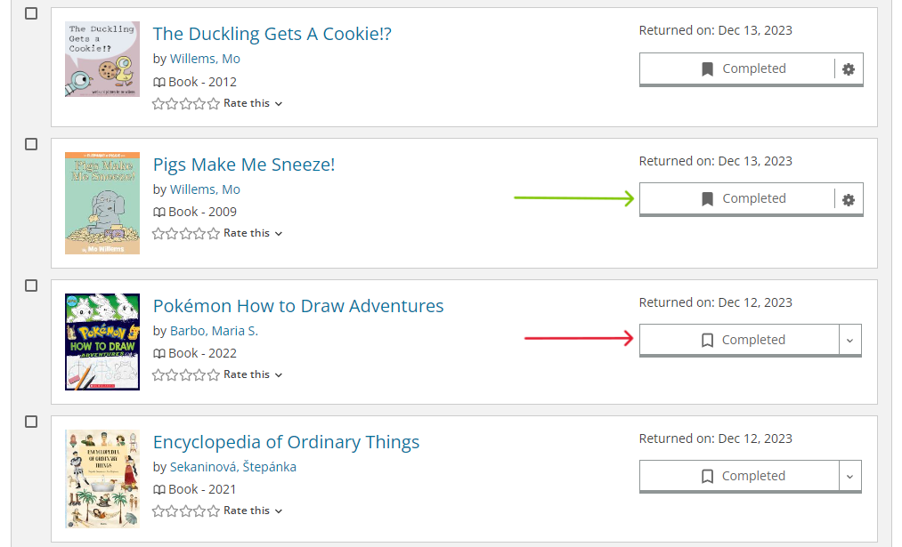
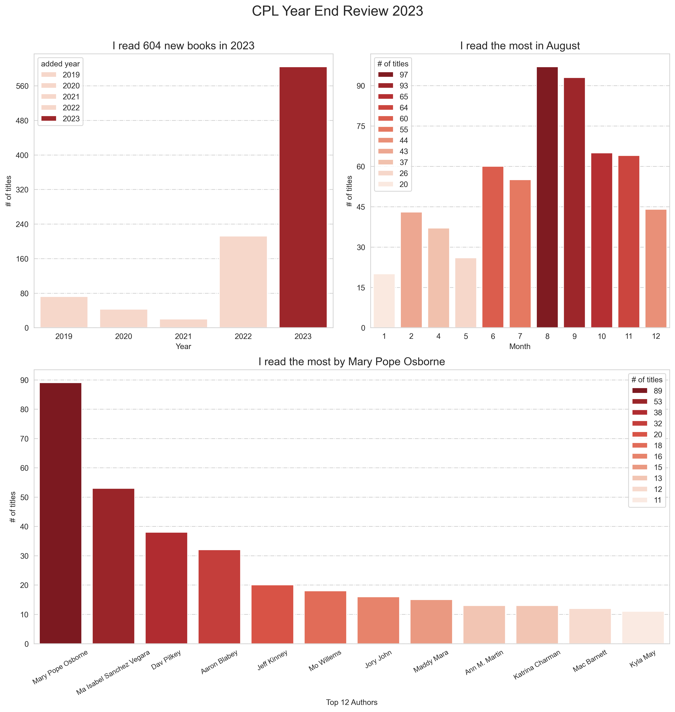
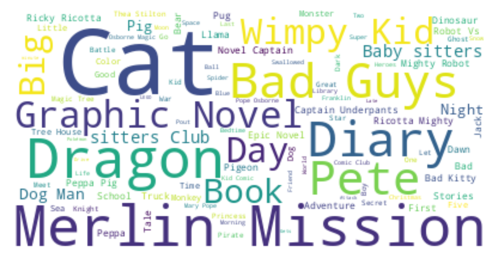

<figure markdown>
{ width="100" }
</figure>

# yyc-library-review

An aggregation of your data in Calgary Public Library

## Caveat

This aggregation only considers books that have been tagged as **Completed**. Therefore, the date reflects the time when a book was moved to the **Completed Shelf** collection, not the actual time when you finished reading it.

To ensure higher accuracy, it is best practice to tag your returned books as soon as possible.

## Example

> Word Cloud of Titles
> 
